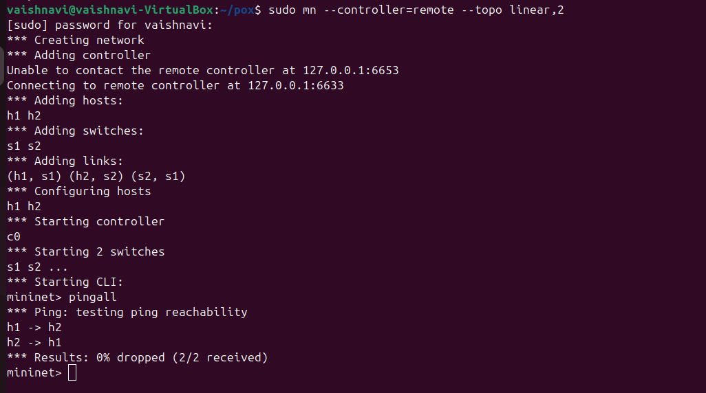
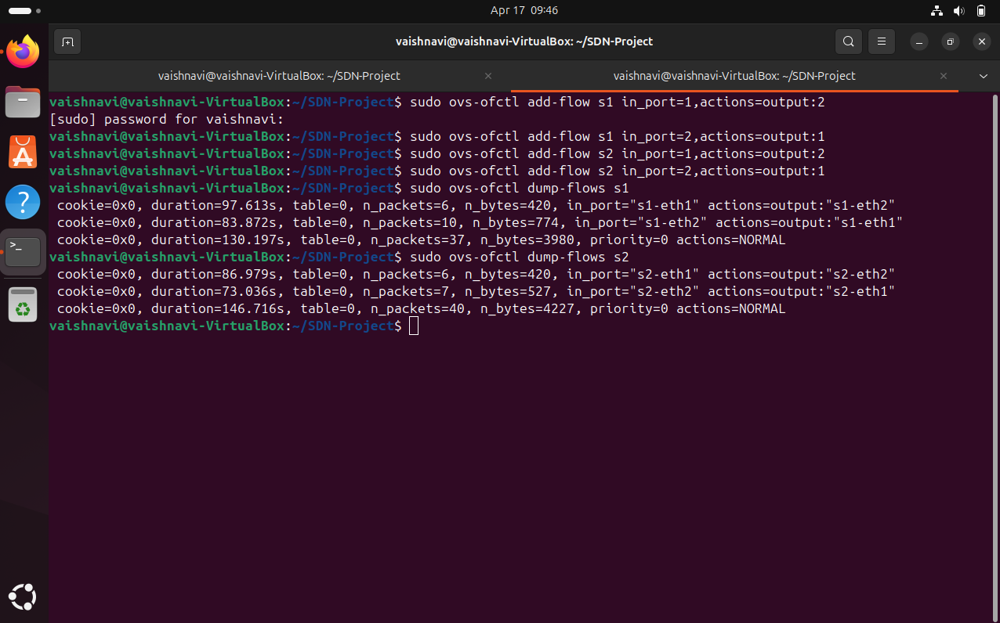

# 🌐 SDN Implementation using Mininet and POX Controller

## 👩‍💻 Student Details

**Name:** Vaishnavi
**SRN:** PES1UG24CS514

---

## 📌 Objective

To implement Software Defined Networking (SDN) using Mininet and POX controller, and demonstrate both dynamic and static routing techniques.

---

## 🧠 Introduction

Software Defined Networking (SDN) separates the control plane from the data plane. A centralized controller manages how packets are forwarded in the network.

---

## 🛠️ Tools Used

* Mininet
* POX Controller
* OpenFlow Protocol
* Ubuntu Linux

---

## 🌐 Network Topology

```
h1 ---- s1 ---- s2 ---- h2
```

---

## 🚀 Scenario 1: Learning Switch (Dynamic Routing)

### Command:

```
python3 pox.py forwarding.l2_learning
```

### Observation:

* Controller learns MAC addresses
* Installs flow rules dynamically
* Efficient forwarding

---

## 🚀 Scenario 2: Hub Mode (Dynamic Routing)

### Command:

```
python3 pox.py forwarding.hub
```

### Observation:

* Packets are flooded
* No learning
* Less efficient

---

## 📈 Results Comparison

| Mode     | Behavior    | Efficiency |
| -------- | ----------- | ---------- |
| Hub      | Flooding    | Low        |
| Learning | Intelligent | High       |

---

## 📸 Screenshots

### 🔹 Learning Mode


### 🔹 Hub Mode


### 🔹 Ping Result (Learning)


### 🔹 Ping Result (Hub)



### 🔹 Network Topology


### 🔹 Dump Output


---

## 🚀 Static Routing using Manual Flow Rules

In addition to controller-based dynamic routing, static routing was implemented by manually installing flow rules in the switches using Open vSwitch (`ovs-ofctl`).

### 🔧 Commands Used

```
sudo ovs-ofctl add-flow s1 in_port=1,actions=output:2
sudo ovs-ofctl add-flow s1 in_port=2,actions=output:1

sudo ovs-ofctl add-flow s2 in_port=1,actions=output:2
sudo ovs-ofctl add-flow s2 in_port=2,actions=output:1
```

---

### 📊 Observation

* Traffic followed a predefined path between hosts
* No packet flooding occurred
* No learning mechanism was used
* Switches forwarded packets strictly based on installed rules

---

### ✅ Verification

* Connectivity tested using pingall
* Achieved 0% packet loss
* Flow rules verified using:

```
sudo ovs-ofctl dump-flows s1
sudo ovs-ofctl dump-flows s2
```

---

## 📸 Static Routing Screenshots

### 🔹 Flow Rules Installed



---

## 🎯 Conclusion

This project demonstrates both dynamic and static routing in SDN. The controller-based approach enables intelligent forwarding, while manual flow installation allows precise control over packet paths.
