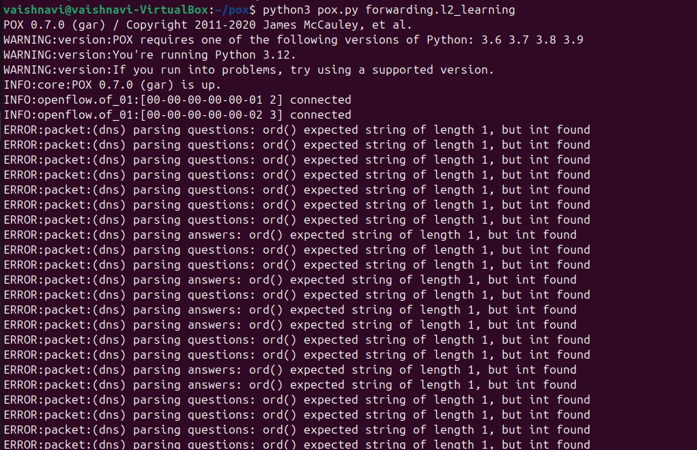
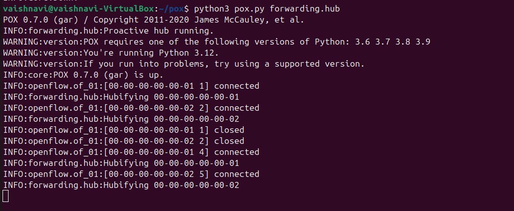
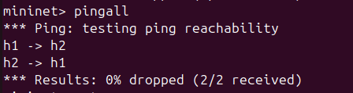
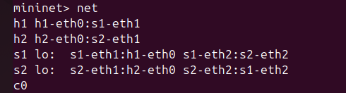
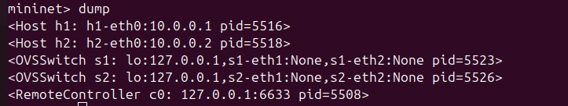

# 🌐 SDN Implementation using Mininet and POX Controller

##  Objective

To design and simulate a Software Defined Network (SDN) using Mininet and a POX controller, demonstrating controller–switch interaction and flow-based packet forwarding.

---

##  Introduction

Software Defined Networking (SDN) separates the control plane from the data plane, allowing centralized control of network behavior.

In this project, Mininet is used to emulate a network topology, while the POX controller dynamically manages packet forwarding by installing flow rules in switches.

---

## 🛠️ Tools & Technologies

* Mininet (Network Emulator)
* POX Controller
* OpenFlow Protocol
* Ubuntu Linux

---

## 🌐 Network Topology

```
h1 ---- s1 ---- s2 ---- h2
```

* h1, h2 → Hosts
* s1, s2 → Switches
* Controller → POX

---

## ⚙️ Implementation Steps

### 🔹 Install Mininet

```
sudo apt install mininet -y
```

### 🔹 Clone POX Controller

```
git clone https://github.com/noxrepo/pox
cd pox
```

---

##  Scenario 1: Learning Switch Mode

### ▶️ Run Controller

```
python3 pox.py forwarding.l2_learning
```

### ▶️ Run Mininet

```
sudo mn --controller=remote --topo linear,2
```

### ▶️ Test Connectivity

```
pingall
```

### 📊 Observation

* Controller learns MAC addresses
* Flow rules are installed dynamically
* Efficient packet forwarding

---

##  Scenario 2: Hub Mode

### ▶️ Run Controller

```
python3 pox.py forwarding.hub
```

### ▶️ Run Mininet

```
sudo mn --controller=remote --topo linear,2
```

### ▶️ Test Connectivity

```
pingall
```

### 📊 Observation

* Packets are flooded to all ports
* No learning mechanism
* Less efficient

---

##  Results & Analysis

| Mode            | Behavior               | Efficiency |
| --------------- | ---------------------- | ---------- |
| Hub Mode        | Flooding               | Low        |
| Learning Switch | Intelligent Forwarding | High       |

---

##  Screenshots

### 🔹 Learning Mode



### 🔹 Hub Mode



### 🔹 Ping Result



### 🔹 Network Topology



### 🔹 Dump Output



---

##  Validation

* Connectivity verified using `pingall`
* Achieved 0% packet loss
* Successful controller–switch interaction

---

##  Conclusion

This project demonstrates the working of Software Defined Networking using Mininet and POX controller. The controller dynamically installs flow rules, enabling efficient communication. The comparison between hub and learning switch highlights the advantages of intelligent forwarding.

---
